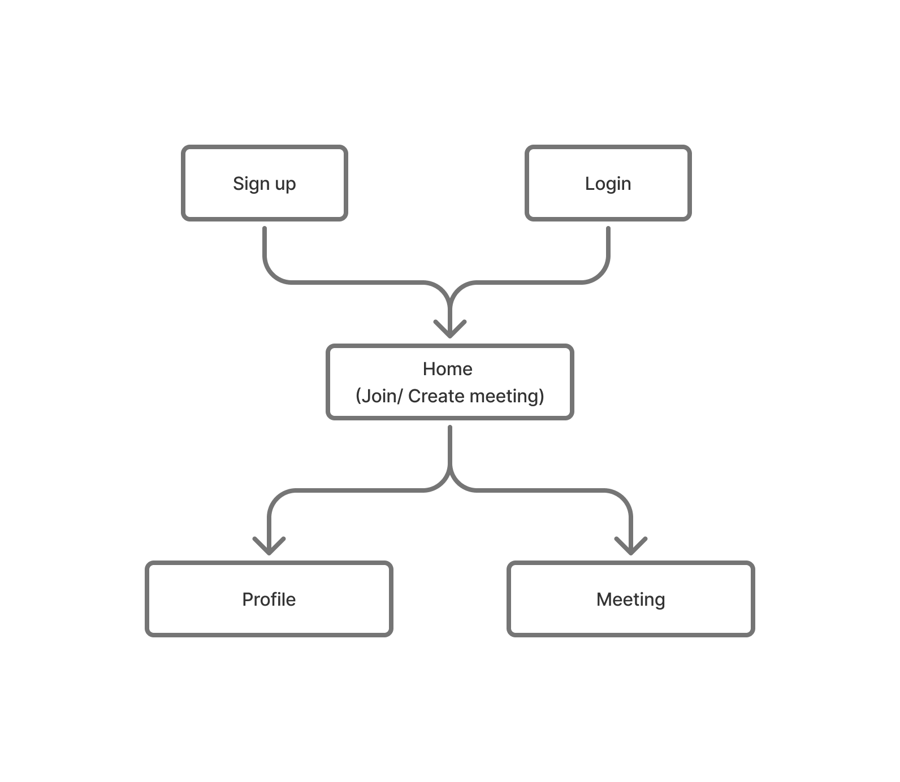
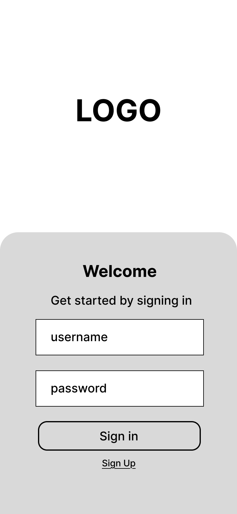
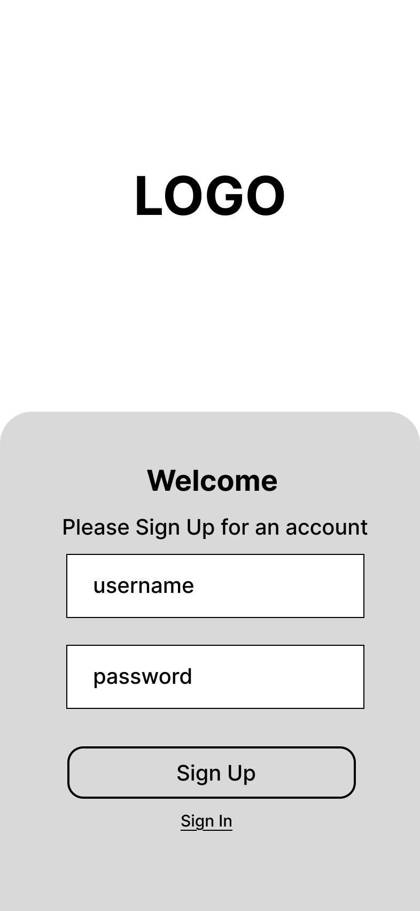
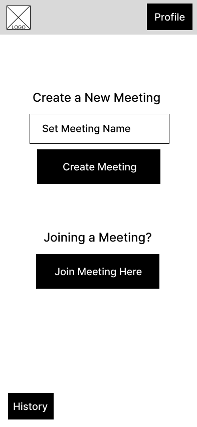
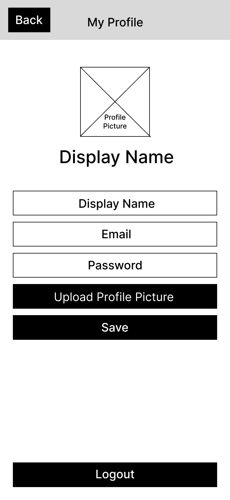
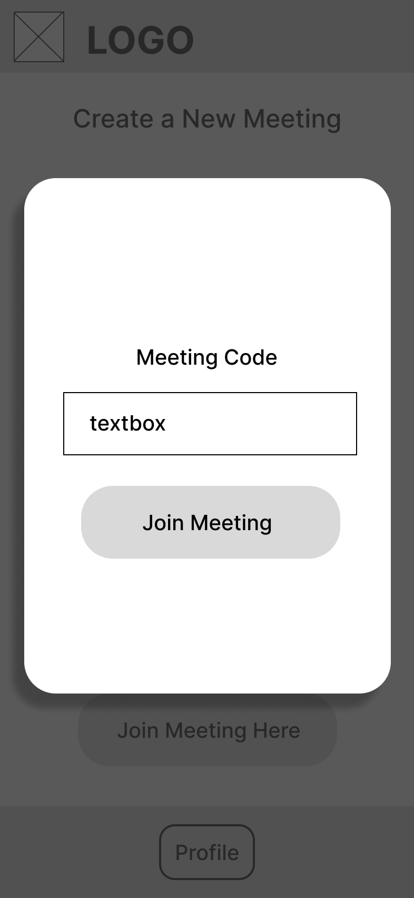
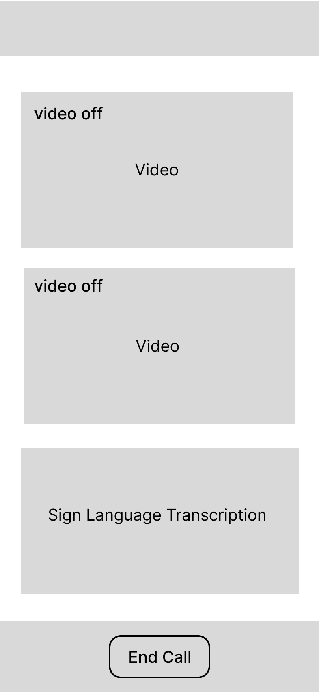

# User Experience Design for gesturetalk

## Site Prototype 
[Link to Site Prototype](https://www.figma.com/proto/CYLPLEl7Iq3l6b4s67Qb20/gesturetalk-Wireframe-and-Prototype?node-id=6-2&p=f&t=63xqQjh0fmtifJg9-0&scaling=scale-down&content-scaling=fixed&page-id=0%3A1&starting-point-node-id=6%3A2&show-proto-sidebar=1&device-frame=0)

Our site prototype utilizes an easily readable, familiar GUI that someone hard of hearing could use even if they are not familiar with technology. We hoped to make it as easy as possible for users to join/create a meeting, as the point of our app is to provide more accessibility to hard of hearing users -- not less. It follows the design principles of similar video calling apps like Zoom. There are two "flows" in our site prototype. Flow 1 relates to a user who has already signed up and is still logged in. It takes the user directly to the home page where they can start or join a meeting. Users will also be able to access the profile page when logged in where they can change information like their picture, screen namem etc.. Flow 2 relates to a user who needs to sign-in or sign-up before accessing gesturetalk. All users will be required to make an account in order to use gesturetalk. 

## App Map
      
[Link to App Map Source](https://www.figma.com/board/mXDyGe4CLLr3FmKj9eIAta/gesturetalk-App-Map?node-id=0-1&t=K30FH86JzFjKx8mg-1) 
       
   
                  
Our web app will have 5 distinct pages as seen above. A user upon opening the app for the first time will be prompted to log-in / sign-up. If a logged-in user has cookies enabled, they will be directed to the home page immediately where they can join or create a gesturetalk meeting. A logged-in user from the home page can also access their profile where they will be able to change information like their screen name, etc.. Creating or joining a meeting will redirect the user to a meeting page.

## Wireframe
       
[Link to Wireframe Source](https://www.figma.com/design/CYLPLEl7Iq3l6b4s67Qb20/gesturetalk-Wireframe-and-Prototype?node-id=0-1&t=zZn2rYZmLR8RMAFH-1)

### Sign In Page

The sign-in page is the first page a user will see when they open gesturetalk. This page will allow account holders to sign in using their credentials. If the user does not have an account, they can click the "Sign Up" button to be redirected to the sign-up page.
       
### Sign Up Page

The sign-up page will allow new users to create an account by entering a Username and Password. Once the user clicks "Sign Up", they will be redirected to the home page and automatically logged in.

### Home Page

The home page is where a logged-in user will be directed to. From here, they can either create a new meeting or be redirected to the join meeting page. The user can also access their profile from this page.
       
### Profile Page

The profile page will allow a logged-in user to view and edit their profile information as well as logout. The user can change their profile picture, display name, email, and password. Once the user clicks the back button, changes will be saved and they will be redirected to the home page. 

### Join Meeting Page

The join meeting page will allow a logged-in user to enter a meeting code to join an existing meeting. Once the user clicks "Join Meeting", they will be redirected to the meeting page.

### Meeting Page

The meeting page is where the user will be able to see other participants in the meeting as well as a live sign language transcription. The user can also leave the meeting by clicking the "End Call" button which will redirect them to the home page.

