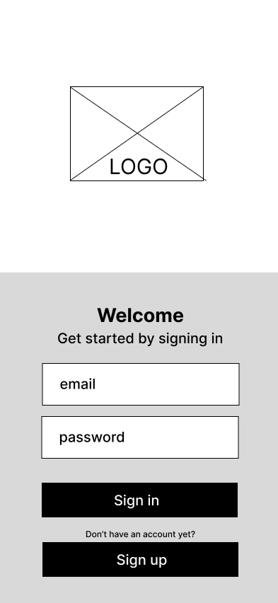
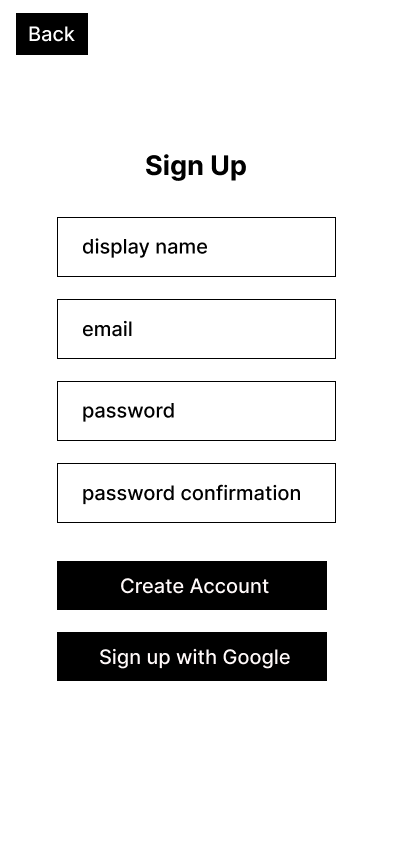
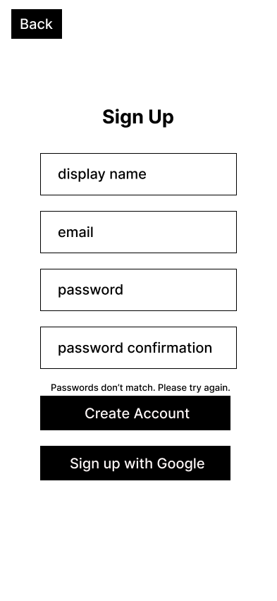
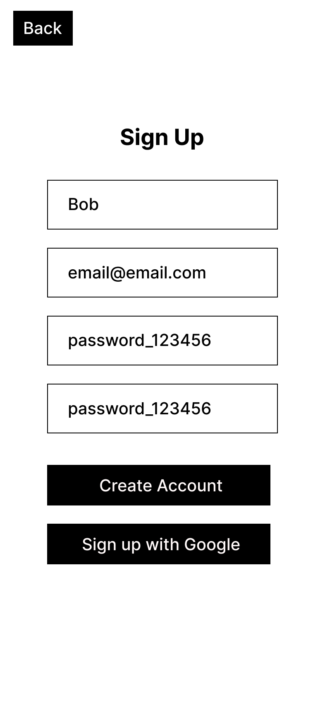
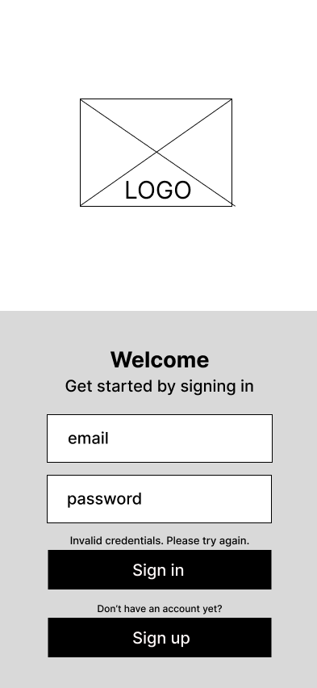
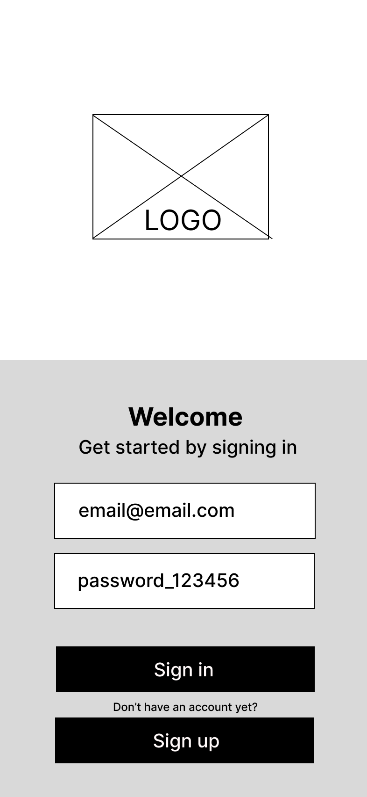
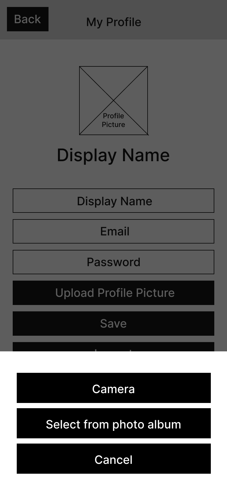
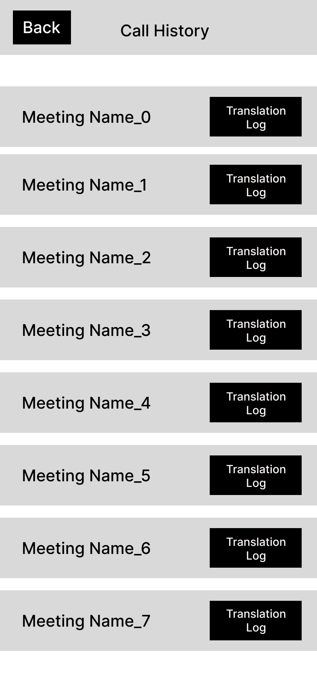

# User Experience Design for gesturetalk

## Site Prototype 
[Link to Site Prototype](https://www.figma.com/proto/CYLPLEl7Iq3l6b4s67Qb20/gesturetalk-Wireframe-and-Prototype?node-id=174-120&t=be6AD7D5J06uhTgD-1&scaling=scale-down&content-scaling=fixed&page-id=0%3A1)

Our site prototype utilizes an easily readable, familiar GUI that someone hard of hearing could use even if they are not familiar with technology. We hoped to make it as easy as possible for users to join/create a meeting, as the point of our app is to provide more accessibility to hard of hearing users -- not less. It follows the design principles of similar video calling apps like Zoom. A user who has already signed up and is still logged in will be taken directly to the home page, where they can start or join a meeting. Users will also be able to access the profile page when logged in where they can change information like their picture, screen name, password, email etc.. Users will also be able to access a call history where they can see the translation logs of past meetings. All users will be required to make an account/login in order to use gesturetalk. 

## App Map
      
[Link to App Map Source](https://www.figma.com/board/mXDyGe4CLLr3FmKj9eIAta/gesturetalk-App-Map?node-id=0-1&t=K30FH86JzFjKx8mg-1) 
       
   
                  
The GestureTalk web application is composed of five main pages: Sign Up / Login, Home, Call History, Profile, and Meeting. When users first access the app, they are prompted to either sign up or log in. Returning users with cookies enabled are automatically redirected to the Home page. From the Home page, users can join or create a GestureTalk meeting, view their Call History, access their Profile, or enter an ongoing Meeting. The Call History page provides a record of past meetings and includes access to a Translation Log that stores the text translations from those sessions. This structure ensures a clear and intuitive navigation flow, connecting user authentication, meeting participation, and activity tracking in a streamlined experience.
## Wireframe
       
[Link to Wireframe Source](https://www.figma.com/design/CYLPLEl7Iq3l6b4s67Qb20/gesturetalk-Wireframe-and-Prototype?node-id=0-1&t=zZn2rYZmLR8RMAFH-1)

### Log In / Sign Up Page

       
### Sign Up Page Blank

### Sign Up Page Invalid

### Sign Up Page Input

### Log In Page Failed 

### Log In Page Input

### Home Page

       
### Profile Page

### Upload Picture Page

### Call History Page

### Upload Picture Page

### Upload Picture Page

### Join Meeting Page

### Meeting Page

