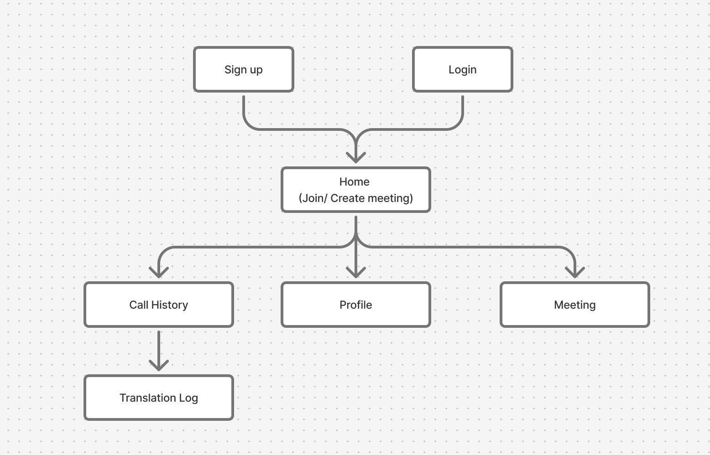
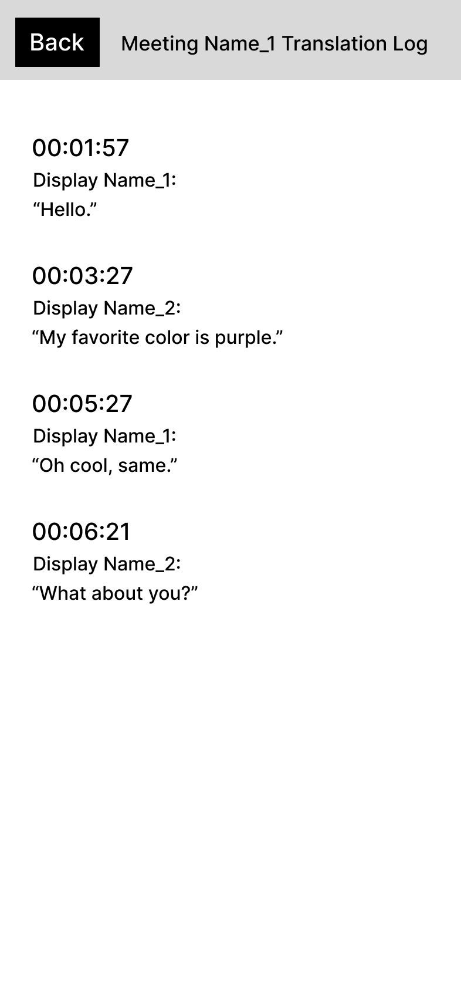

# User Experience Design for gesturetalk

## Site Prototype 
[Link to Site Prototype](https://www.figma.com/proto/CYLPLEl7Iq3l6b4s67Qb20/gesturetalk-Wireframe-and-Prototype?node-id=174-120&t=be6AD7D5J06uhTgD-1&scaling=scale-down&content-scaling=fixed&page-id=0%3A1)

Our site prototype utilizes an easily readable, familiar GUI that someone hard of hearing could use even if they are not familiar with technology. We hoped to make it as easy as possible for users to join/create a meeting, as the point of our app is to provide more accessibility to hard of hearing users -- not less. It follows the design principles of similar video calling apps like Zoom. A user who has already signed up and is still logged in will be taken directly to the home page, where they can start or join a meeting. Users will also be able to access the profile page when logged in where they can change information like their picture, screen name, password, email etc.. Users will also be able to access a call history where they can see the translation logs of past meetings. All users will be required to make an account/login in order to use gesturetalk. 

## App Map
      
[Link to App Map Source](https://www.figma.com/board/mXDyGe4CLLr3FmKj9eIAta/gesturetalk-App-Map?node-id=0-1&t=K30FH86JzFjKx8mg-1) 
       
   
                  
The GestureTalk web application is composed of five main pages: Sign Up / Login, Home, Call History, Profile, and Meeting. When users first access the app, they are prompted to either sign up or log in. Returning users with cookies enabled are automatically redirected to the Home page. From the Home page, users can join or create a GestureTalk meeting, view their Call History, access their Profile, or enter an ongoing Meeting. The Call History page provides a record of past meetings and includes access to a Translation Log that stores the text translations from those sessions. This structure ensures a clear and intuitive navigation flow, connecting user authentication, meeting participation, and activity tracking in a streamlined experience.
## Wireframe
       
[Link to Wireframe Source](https://www.figma.com/design/CYLPLEl7Iq3l6b4s67Qb20/gesturetalk-Wireframe-and-Prototype?node-id=0-1&t=zZn2rYZmLR8RMAFH-1)

### Log In / Sign Up Page
The sign-in page is the first page a user will see when they open gesturetalk. This page will allow account holders to sign in using their credentials. If the user does not have an account, they can click the "Sign Up" button to be redirected to the sign-up page.

       
### Sign Up Page Blank
The sign-up page will allow new users to create an account by entering a Username, Password, and Email. Once the user clicks "Sign Up", they will be redirected to the home page and automatically logged in.

### Sign Up Page Invalid
The sign up page will show an error message if the passwords do not match or if the username already exists.

### Sign Up Page Input
An example of the sign up page being gilled out properly.

### Log In Page Invalid 
Log In page shows an error message if the password does not align with the email or if there is no account associated with the email.

### Log In Page Input
An example of the Log In page being properly filled out.

### Home Page
The home page is where a logged-in user will be directed to. From here, they can either create a new meeting or be redirected to the join meeting page. The user can also access their profile from this page.

       
### Profile Page
The profile page will allow a logged-in user to view and edit their profile information as well as logout. The user can change their profile picture, display name, email, and password. Once the user clicks the back button, changes will be saved and they will be redirected to the home page. 

### Upload Picture Page
The Upload Picture Page prompts the user if they would like to upload an image from their album or take a new photo with their camera for their profile image.

### Call History Page
The Call History page lists all the past meetings that the user has joined.

### Transcription Log Page
The Transcription Log page shows the sign language to text transcriptions only log.

### Join Meeting Page Blank
The join meeting page will allow a logged-in user to enter a meeting code to join an existing meeting. Once the user clicks "Join Meeting", they will be redirected to the meeting page.

### Join Meeting Page Invalid
The join meeting page will show an error message if the inputted code does not exist.

### Join Meeting Page Input
An example of the join meeting page being filled out.

### Create Meeting Page
The create meeting page shows the code of the created meeting, which can be copied and shared by pasting.

### Meeting Page
The meeting page is where the user will be able to see other participants in the meeting as well as a live sign language transcription. The user can also leave the meeting by clicking the "End Call" button which will redirect them to the home page.

### Meeting Details Page
The meeting details page allows the meeting's name to be changed and for the meeting code to be copied again.

### Edit Meeting Name Page
An example of the editing meeting name page being filled out.

### Meeting Renamed Page
An example of the meeting name changed.

